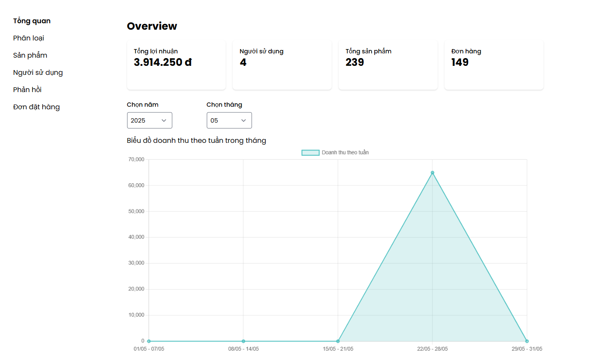

# Website Thương Mại Điện Tử Bách Hóa (Grocery E-commerce)

Dự án xây dựng một hệ thống thương mại điện tử hoàn chỉnh, chuyên cung cấp các mặt hàng bách hóa. Hệ thống được phát triển dựa trên kiến trúc hướng dịch vụ (SOA), giao tiếp thông qua RESTful API, đảm bảo sự linh hoạt, khả năng mở rộng và bảo trì.

## Tổng Quan (Overview)

Đây là một ứng dụng web full-stack bao gồm trang web phía client (Frontend) cho người dùng tương tác và hệ thống phía máy chủ (Backend) để xử lý logic nghiệp vụ, quản lý dữ liệu và xác thực. Dự án được đóng gói bằng Docker để đơn giản hóa quá trình triển khai và đảm bảo tính nhất quán trên các môi trường khác nhau.

## Tính Năng Nổi Bật (Features)

### Chức năng cho người dùng (Client-Side):
-   **Đăng ký / Đăng nhập:** Xác thực người dùng bằng jwt.
-   **Xem và tìm kiếm sản phẩm:** Có hỗ trợ lọc và sắp xếp sản phẩm.
-   **Xem chi tiết sản phẩm**. 
-   **Quản lý giỏ hàng:** Thêm, xóa, cập nhật số lượng, chọn sản phẩm muốn đặt hàng bằng checkbox.
-   **Đặt hàng và thanh toán:** Có tích hợp VN PAY Sandbox.
-   **Trang cá nhân:**
    +    **Quản lý thông tin cá nhân**.
    +    **Lịch sử mua hàng:** Hủy đơn hàng khi đơn hàng chưa giao.
    +    **Danh sách sản phẩm yêu thích**.
-   **Đánh giá sản phẩm**.
-   **Upload ảnh:** Được upload lên nền tảng Cloudinary.

### Chức năng cho quản trị viên (Admin-Side):
-   **Dashboard tổng quan:** Biểu đồ thống kê doanh thu theo tháng.
-   **Quản lý danh mục sản phẩm:**.
-   **Quản lý sản phẩm:**.
-   **Quản lý đơn hàng:** cập nhật trạng thái đơn hàng, chỉnh sửa thông tin giao hàng, xuất hóa đơn.
-   **Quản lý người dùng:** Khóa tài khoản người dùng.
-   **Quản lý phản hồi:** Ẩn phản hồi sản phẩm.

### Kiểm thử (Testing):
-   **White Box Testing:** Sử dụng **JUnit** trong Spring Boot để kiểm thử đơn vị (Unit Test), đảm bảo tính đúng đắn của các logic nghiệp vụ ở tầng Backend.
-   **Black Box Testing:** Sử dụng **Selenium** để thực hiện kiểm thử tự động hóa giao diện người dùng (E2E Testing), giả lập các hành vi của người dùng trên trình duyệt.

## Công Nghệ Sử Dụng (Technologies Used)

-   **Backend:**
    -   **Framework:** Spring Boot 3, Spring Web (RESTful API)
    -   **Data Access:** Spring Data JPA, Hibernate
    -   **Security:** Spring Security, JWT
    -   **Build Tool:** Maven
    -   **Language:** Java 21
-   **Frontend:**
    -   **Library:** ReactJS 18
    -   **State Management:** Redux Toolkit
    -   **HTTP Client:** Axios
    -   **Styling:** Tailwind CSS / Material-UI
    -   **Build Tool:** Vite / Create React App
-   **Cơ sở dữ liệu (Database):**
    -   MySQL 8
-   **Containerization & Deployment:**
    -   Docker, Docker Compose
-   **Testing:**
    -   JUnit 5, Mockito (Backend)
    -   Selenium WebDriver (E2E)
-   **DevOps Tools:** Docker Hub.

## Hướng Dẫn Cài Đặt và Chạy Ứng Dụng (Local)

### Yêu cầu tiên quyết
-   Git
-   JDK 21 (hoặc phiên bản tương thích)
-   Maven 3.9+
-   Node.js 20+ và npm
-   Docker và Docker Compose

### 1. Clone repository

```bash
# Clone repository về máy
git clone https://github.com/HuyLearnProgram/webbachhoa.git
cd webbachhoa
```

### 2.Database Setup:
```bash
# Tạo database MySQL
mysql -u root -p
CREATE DATABASE webnongsan;
```
Chạy file .sql trong thư mục SQL

### 3.Configuration Backend:
```bash
# Cập nhật application.properties
spring.datasource.url=${DBMS_CONNECTION:jdbc:mysql://localhost:3306/webnongsan}
spring.datasource.username=root
spring.datasource.password=<your_password>
```

### 4.Run Backend:
Chạy trực tiếp trên IntelliJ hoặc dùng lệnh
```bash
# Build và chạy ứng dụng
mvn clean install
mvn spring-boot:run
```
Backend sẽ chạy tại: http://localhost:8080

### 5.Cài đặt Frontend (React JS)
```bash
cd client
npm install
```
### Cấu hình lại file .env:
```bash
VITE_BACKEND_URL = "http://localhost:8080/api/v2"
VITE_BACKEND_TARGET = http://localhost:8080
VITE_RECOMMENDED_URL = http://localhost:8000
```
### Run front end:
```bash
npm run dev
```
Frontend sẽ chạy tại: http://localhost:5173

## Docker Setup
### 1.Create Docker Network:
```bash
docker network create webnongsan-network
```
### 2.Run MySQL Container:
```bash
docker run --network webnongsan-network --name mysql -p 3306:3306 -e MYSQL_ROOT_PASSWORD=123456 -e MYSQL_DATABASE=webnongsan -d mysql:8.0.36-debian
```
### 3.Build và Run Backend Container:
```bash
# Build backend image
cd backend
docker build -t webnongsan-backend:0.0.1 .

# Run backend container
docker run --name webnongsan-backend --network webnongsan-network -p 8080:8080 -e DBMS_CONNECTION=jdbc:mysql://mysql:3306/webnongsan webnongsan-backend:0.0.1
```
### 4.Build và Run Frontend Container:
```bash
# Build frontend image
cd frontend
docker build -t webnongsan-frontend:0.0.1 .

# Run frontend container
docker run --name webnongsan-frontend --network webnongsan-network -p 3000:3000 webnongsan-frontend:0.0.1
```
Frontend sẽ chạy tại: http://localhost:3000
### Docker Hub Images
### Pull từ Docker Hub:
```bash
# Pull backend image
docker pull huyprogram/webnongsan-backend:0.0.1

# Run từ Docker Hub image
docker run --name webnongsan-backend --network webnongsan-network -p 8080:8080 -e DBMS_CONNECTION=jdbc:mysql://mysql:3306/webnongsan huyprogram/webnongsan-backend:0.0.1

# Pull frontend image
docker pull huyprogram/webnongsan-frontend:0.0.1
# Run từ Docker Hub image
 docker run -d -p 3000:80 --name webnongsan-frontend huyprogram/webnongsan-frontend:0.0.1
```

## Site Images
### Login, Sign Up & Forget Password


### Trang chủ


### Trang tìm kiếm và lọc sản phẩm


### Trang chi tiết sản phẩm


### Trang giỏ hàng


### Trang thanh toán


### Trang quản lý thông tin cá nhân


### Trang tổng quan báo cáo doanh thu (Admin):


### Trang quản lý danh mục sản phẩm (Admin):


### Trang quản lý sản phẩm (Admin):


### Trang quản lý người dùng (Admin):


### Trang quản lý đơn hàng (Admin):


### Trang quản lý feedback (Admin):


